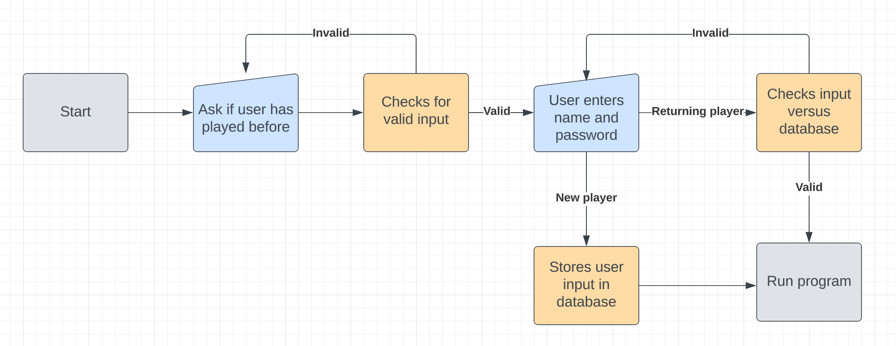
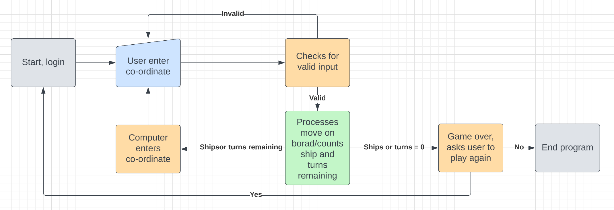

# Battleships

Battleship is a game of chance and logic where players attempt to sink each others ships by guessing co-ordinates.
In this game you have a Python generated board of rows and columns and play against the computer that will randomised guesses to try sink the users ships.

(Developer: Paul McCormack)

[Live webpage](https://battleship-pp3-macker85.herokuapp.com/)

## Table of Content

1. [Project Goals](#project-goals)
    1. [User Goals](#user-goals)
    2. [Site Owner Goals](#site-owner-goals)
2. [User Experience](#user-experience)
    1. [Target Audience](#target-audience)
    2. [User Requirements and Expectations](#user-requirements-and-expectations)
    3. [User Stories](#user-stories)
3. [Technical Design](#technical-design)
    1. [Flowchart](#flowchart)
4. [Technologies Used](#technologies-used)
    1. [Languages](#languages)
    2. [Frameworks & Tools](#frameworks-&-tools)
5. [Features](#features)
6. [Testing](#validation)
    1. [PEP8 validation](#pep8-validation)
    2. [Testing user stories](#testing-user-stories)
8. [Bugs](#Bugs)
9. [Deployment](#deployment)
10. [Credits](#credits)
11. [Acknowledgments](#acknowledgments)

## Project Goals 
The goal of this project is to create a logic and chance based game using Python.

### User Goals
The goal for the user is to play a logic and chance game in Python.

### Site Owner Goals
- Create an application that challenges players use of logic.
- Create an application that give the user instant feedback after input.
- Make the application easily understandable and easy to follow.
- Ensure the application is intuitive to navigate.

## User Experience

### Target Audience
- Users who like playing games or challenging themselves with logical games.
- Users who are looking for a game to pass time on during a break.
- Nostalgic users that may have played Battleship when they were younger.

### User Requirements and Expectations

### User Stories
1. Told the perameters of the game.
2. Create a personal username and have it used in the experience.
3. To be able to return to the game with my username and password.
4. Get real-time feedback when playing the game.
5. To play against against a computer opponent.
6. To be told when the game has been won or lost.
7. To be able to restart or exit the game when finished.

## Technical Design

### Flowchart

Login

Game

### Data Modelling
- The data stored in the Google Spreadsheet is a combination of a username and password entered by the user on the login page.

- A new user will enter their choice of username and password which will be stored in the spreadsheet "battleship usernames" which will b accessed with SHEET = GSPREAD_CLIENT.open("battleship usernames") and then in the worksheet 'usernames'. Their password will be stored in the same spreadsheet but in the 'passwords' worksheet.

- A returning user will type in their username, the function will check the 'usernames' worksheet for a matching value and return a welcome message if true. The user will be prompted for a password and the function will, once again, check the 'passwords' worksheet for a matching value. If the function returns both inputs then the user will be allowed to play the game.

- If the returning user inputs do not match, the user will be taken to the start of the login function where they can try again or enter a new set of credentials.

## Technologies Used

### Languages
- Python 3

### Frameworks & Tools
- Heroku
- Google Drive: Used as a cloud hosting platform for the spreadsheet.
- Google Spreadsheet: Used because Python does not have a built in library to store data in an external spreadsheet.
- pep8 CI validator
- gitHub
- Gitpod
- Git
- LucidChart

## Features

### Welcome Message and game parameters
- Shows a welcome message with game parameters.
User Stories covered: 1, 4

### Username/Password Input
- Prompts a user to input a username and password.
- Returning users will have their credentials checked from the associateed spreadsheet.
User Stories covered: 2,3,4

### Game Board
- Generates the game boards for the user and the computer.
User Stories covered: 4, 5

### Game Inputs
- Allows the user to input their guesses and feedsback the result.
- Shows the computer's guess with outcome of guess.
User Stories covered: 4, 5

### Game Over
- Shows the end-of-game state to the user once a victory condition has been met.
- Allows user to retry the game or to quit the program.
User Stories covered: 6, 7

## Validation

### PEP8 validation
<!-- At the time of creation, the PEP8 online Python validation website was inoperative. To validate the code, a PEP8 validator that is built into the GitPod Workspace was used.

1. Run the command 'pip3 install pycodestyle'. (Note that this extension may already be installed, in which case this command will do nothing.)
2. In the workspace, press Ctrl+Shift+P (or Cmd+Shift+P on Mac).
3. Type the word 'linter' into the search bar that appears. 
4. Click on 'Python: Select Linter' from the filtered results.
5. Select 'pycodestyle' from the list.
6. PEP8 errors will now be underlined in red, as well as being listed in the PROBLEMS tab beside the terminal.

There were no errors or warnings flagged in login.py.
There were no errors or warnings flagged in test_login.py
15 yellow warnings were flagged in run.py. These are down to the symbol combinations used in the ASCII art and logo. These are printed direct to the console and not used in any functions. -->

### Testing user stories

1. To create a personal username.

| **Feature** | **Action** | **Expected Result** | **Actual Result** |
|-------------|------------|---------------------|-------------------|
| Welcome Screen. | Input 'Y' to set up a new profile. Enter username. | Accepts input and stores username to spreadsheet. | Working as implemented. |

Welcome Screen

2. To be able to return to the game with my username and password.

| **Feature** | **Action** | **Expected Result** | **Actual Result** |
|-------------|------------|---------------------|-------------------|
| Welcome Screen. | Input 'N' and type in username and password. | Accepts input and checks spreadseet for the input values. | Working as implemented. 

Welcome Screen

3. To have an immersive experience.

| **Feature** | **Action** | **Expected Result** | **Actual Result** |
|-------------|------------|---------------------|-------------------|
| Welcome Screen. | Input username. | Console prints message welcoming the user as Admiral. | Working as implemented. |
| Main Screen. | Shows after user inputs username and password. | Console prints ASCII warship and game logo. | Working as implemented. |
| Game Board. | Generates upon game start. | Generates a board similar to the board game. | Working as implemented. |
| Game Inputs. | User inputs co-ordinates to fire on. | Feedback uses military terminology. | Working as implemented. |

Welcome Screen

Main Screen

Game Board

Game Inputs

4. To have real-time feedback when playing the game.

| **Feature** | **Action** | **Expected Result** | **Actual Result** |
|-------------|------------|---------------------|-------------------|
| Welcome Screen. | Input username and password. | Console feedsback messages to user. | Working as implemented. |
| Game Board. | Generates at the start of the game and refreshes after every turn. | Game board is printed and updated with user and computer inputs after each turn. | Working as implemented. |
| Game Inputs. | User inputs their choice of co-ordinates. Computer does the same. | Results are printed back to the user after each turn. | Working as implemented. |

Welcome Screen

Game Board

Game Inputs

5. To be able to play the game against a computer opponent.

| **Feature** | **Action** | **Expected Result** | **Actual Result** |
|-------------|------------|---------------------|-------------------|
| Game Board. |  Generates at the start of the game and refreshes after every turn. | Game board is printed and updated with user and computer inputs after each turn. | Working as implemented. |
| Game Inputs. | Computer generates a shot after the user has taken a turn. | Results are updated on the board and printed back to the user after each computer turn. | Working as implemented. |

Game Board

Game Inputs

6. To be told when the game has been won or lost.

| **Feature** | **Action** | **Expected Result** | **Actual Result** |
|-------------|------------|---------------------|-------------------|
| Game Inputs. | After a game over condition is met. | Game over condition is printed back to the user. | Working as implemented. |
| Game Over. | After a game over condition is met. | Results are updated on the board and printed back to the user after each computer turn. | Working as implemented. |

Game Inputs

Game Over

7. To be able to easily replay the game if wanted.

| **Feature** | **Action** | **Expected Result** | **Actual Result** |
|-------------|------------|---------------------|-------------------|
| Game Over. | After a game over condition is met. User inputs Y or N | Input of Y re-runs the game. Input of N exits the program. | Working as implemented. |

Game Over

## Bugs

| **Bug** | **Fix** |
| ----------- | ----------- |
| Spacings between classes too small, stopped programme running. | adjusted spacings |
| Game crashing after guess input. | Fix typo in y-col input. |
| Game looping after entering new player | Fixed typo in new player function |
| Computer counting all ships as hits and ending game | Changed ship symbol |

## Deployment
Use the following steps to deploy the poject to Heroku:
1. Use the "pip3 freeze -> requiremnts.txt" command in the gitPod terminal; to save any libraries that need to be installed to the project files in Heroku.
2. You will need a Heroku account for deployment, if you don't have one you will need to create one. Once done, log into Heroku.
3. Click the "New" button in the upper right corner and select "Create New App".
4. Choose an app name and your region and click "Create App". Note: the app name must be unique.
5. Go to the "Settings" tab, add the python build pack and then the node.js build pack. This is to ensure the project functions correctly with the Code Institute pre-installed template.
6. Create a "Config VAR" with the 'CREDS' key and the enter the value of the creds.json file.
7. Create a second "Config VAR" with the key of 'PORT' and value of '8000'
8. Go to the "Deploy" tab and pick GitHub as a deployment method.
9. Search for a repository to connect to.
10. Click enable automatic deploys and then deploy branch.
11. Wait for the app to build and then click on the "View" link.

You can fork the repository by following these steps:
1. Login or signup to [GitHub](https://github.com/)
2. Find the relevant repo, which is in this case ['Battleship-Game'](https://github.com/Macker85/Battleship-game)
3. Click on the 'Fork' button in the upper left.
4. A forked version of this repo will be generated.

You can clone the repository by following these steps:
1. On GitHub.com, navigate to the main page of the repository which is ['here'](https://github.com/)
2. Above the list of files, click  Code.
3. Copy the URL for the repository.
4. Open Git Bash.
5. Change the current working directory to the location where you want the cloned directory.
6. Type git clone, and then paste the URL you copied earlier.
7. Press Enter to create your local clone.

## Credits

### Code
- Code Institute Love Sandwiches project.
- Stackoverflow.com
- Fabio Musanni https://www.youtube.com/watch?v=LUWyA3m_-r0&t=283s
- Knowledge Mavens https://www.youtube.com/watch?v=alJH_c9t4zw&t=673s

## Acknowledgments
<!-- I would like to take the opportunity to thank:
- My mentor Mo Shami for his feedback, advice, guidance and support.
- My beautiful wife, Megan, for her continued love and support.
- Jim, Sawyer, and the other fantasic members of Code Institute's community team.
- The great people of class June '22 for their ideas and humour. -->