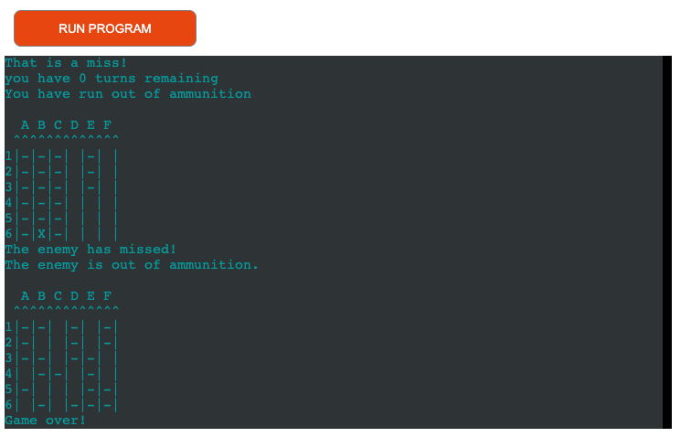

# Battleships

Battleship is a game of chance and logic where players attempt to sink each others ships by guessing co-ordinates.
In this game you have a Python generated board of rows and columns and play against the computer that will randomised guesses to try sink the users ships.

(Developer: Paul McCormack)

[Live webpage](https://battleship-pp3-macker85.herokuapp.com/)

## Table of Content

1. [Project Goals](#project-goals)
    1. [User Goals](#user-goals)
    2. [Site Owner Goals](#site-owner-goals)
2. [User Experience](#user-experience)
    1. [Target Audience](#target-audience)
    2. [User Stories](#user-stories)
3. [Technical Design](#technical-design)
    1. [Flowchart](#flowchart)
4. [Technologies Used](#technologies-used)
    1. [Languages](#languages)
    2. [Frameworks & Tools](#frameworks-&-tools)
5. [Features](#features)
6. [Testing](#validation)
    1. [PEP8 validation](#pep8-validation)
    2. [Testing user stories](#testing-user-stories)
8. [Bugs](#Bugs)
9. [Deployment](#deployment)
10. [Credits](#credits)
11. [Acknowledgments](#acknowledgments)

## Project Goals 
The goal of this project is to create a logic and chance based game using Python.

### User Goals
The goal for the user is to play a logic and chance game in Python.

### Site Owner Goals
- Create an application that challenges players use of logic.
- Create an application that give the user instant feedback after input.
- Make the application easily understandable and easy to follow.
- Ensure the application is intuitive to navigate.

## User Experience

### Target Audience
- Users who like playing games or challenging themselves with logical games.
- Users who are looking for a game to pass time on during a break.
- Nostalgic users that may have played Battleship when they were younger.

### User Stories
1. Told the parameters of the game.
2. Create a personal username and have it used in the experience.
3. To be able to return to the game with my username and password.
4. Get real-time feedback when playing the game.
5. To play against against a computer opponent.
6. To be told when the game has been won or lost.
7. To be able to restart or exit the game when finished.

## Technical Design

### Flowchart

Login

Game

### Data Modelling
- The data stored in the Google Spreadsheet is a combination of a username and password entered by the user on the login page.

- A new user will enter their choice of username and password which will be stored in the spreadsheet "battleship usernames" which will b accessed with SHEET = GSPREAD_CLIENT.open("battleship usernames") and then in the worksheet 'usernames'. Their password will be stored in the same spreadsheet but in the "passwords" worksheet.

- A returning user will type in their username, the function will check the "usernames" worksheet for a matching value and return a welcome message if true. The user will be prompted for a password and the function will then check the "passwords" worksheet for a matching value. If the function returns both inputs then the user will be allowed to play the game, if not they will be prompted to try again at the login function.

## Technologies Used

### Languages
- Python 3

### Frameworks & Tools
- Heroku
- Google Drive: Used as a cloud hosting platform for the spreadsheet.
- Google Spreadsheet: Used because Python does not have a built in library to store data in an external spreadsheet.
- pep8 CI validator
- gitHub
- Gitpod
- Git
- LucidChart

## Features

### Welcome Message and game parameters
- Shows a welcome message with game parameters.
User Stories covered: 1, 4

### Username/Password Input
- Prompts a user to input a username and password.
- Returning users will have their credentials checked from the associateed spreadsheet.
User Stories covered: 2,3,4

### Game Board
- Generates the game boards for the user and the computer.
User Stories covered: 4, 5

### Game Inputs
- Allows the user to input their guesses and feedsback the result.
- Shows the computer's guess with outcome of guess.
User Stories covered: 4, 5

### Game Over
- Shows the end-of-game set-up to the user once a victory condition has been met.
- Allows user to retry the game or to quit the program.
User Stories covered: 6, 7

## Validation

### PEP8 validation
Checked on Code institute validator - https://pep8ci.herokuapp.com/

### Testing user stories

1. Told the parameters of the game.

| **Feature** | **Action** | **Expected Result** | **Actual Result** |
|-------------|------------|---------------------|-------------------|
| Login screen. | Loads at running of programme. | Shows game parameters and welcomes and asks user if tehy have played before. | Working as expected. |

2. Create a personal username and have it used in the experience.

| **Feature** | **Action** | **Expected Result** | **Actual Result** |
|-------------|------------|---------------------|-------------------|
| Login Screen. | Input 'N' and create username and password. | Accepts input and checks spreadseet for the input values. | Working as expected. 

3. To be able to return to the game with my username and password.

| **Feature** | **Action** | **Expected Result** | **Actual Result** |
|-------------|------------|---------------------|-------------------|
| Login Screen. | Input username. | Console prints message welcoming the user back to the game. | Working as expected. |

4. Get real-time feedback when playing the game.

| **Feature** | **Action** | **Expected Result** | **Actual Result** |
|-------------|------------|---------------------|-------------------|
| Welcome Screen. | Input username and password. | Console feedsback messages to user. | Working as expected. |
| Game Board. | Generates at the start of the game and refreshes after every turn. | Game board is printed and updated with user and computer inputs after each turn. | Working as expected. |
| Game Inputs. | User inputs their choice of co-ordinates. | Results are printed back to the user after each turn. | Working as expected. |
| Game Inputs. | User inputs their choice new game or exit programme. | Results are printed back to the user after each turn. | Working as expected. |

5. To play against against a computer opponent.

| **Feature** | **Action** | **Expected Result** | **Actual Result** |
|-------------|------------|---------------------|-------------------|
| Game Board. |  Generates at the start of the game and refreshes after every turn. | Game board is printed and updated with user and computer inputs after each turn. | Working as expected. |
| Game Inputs. | Computer generates a shot after the user has taken a turn. | Results are updated on the board and printed back to the user after each computer turn. | Working as expected. |

6. To be told when the game has been won or lost.

| **Feature** | **Action** | **Expected Result** | **Actual Result** |
|-------------|------------|---------------------|-------------------|
| Function that runs after game parameters are complete. | After a, end game condition is met, print statement. | End game result is printed back to the user. | Working as expected. |

7. To be able to restart or exit the game when finished.

| **Feature** | **Action** | **Expected Result** | **Actual Result** |
|-------------|------------|---------------------|-------------------|
| End game function. | After a game over condition is met. User inputs Y or N afer prompt. | Input of Y re-runs the game. Input of N exits the program. | Working as expected. |

## Bugs

| **Bug** | **Fix** |
| ----------- | ----------- |
| Spacings between classes too small, stopped programme running. | adjusted spacings |
| Game crashing after guess input. | Fixed typo in y-col input. |
| Game looping after entering new player | Fixed typo in new player function |
| Computer counting all ships as hits and ending game | Changed ship symbol |
| Turn counter going down after hit, leading to player always out of turns first | Moved turn counter into miss logic |

## Deployment
Use the following steps to deploy the poject to Heroku:
1. Use the "pip3 freeze -> requiremnts.txt" command in the gitPod terminal; to save any libraries that need to be installed to the project files in Heroku.

2. You will need a Heroku account for deployment, if you don't have one you will need to create one. Once done, log into Heroku.

3. Click the "New" button in the upper right corner and select "Create New App".

4. Choose an app name and your region and click "Create App". Note: the app name must be unique.

5. Go to the "Settings" tab, add the python build pack and then the node.js build pack. This is to ensure the project functions correctly with the Code Institute pre-installed template.

6. Create a "Config VAR" with the 'CREDS' key and the enter the value of the creds.json file.
7. Create a second "Config VAR" with the key of 'PORT' and value of '8000'
8. Go to the "Deploy" tab and pick GitHub as a deployment method.
9. Search for a repository to connect to.
10. Click enable automatic deploys and then deploy branch.
11. Wait for the app to build and then click on the "View" link.

You can fork the repository by following these steps:
1. Login or signup to [GitHub](https://github.com/)
2. Find the relevant repo, which is in this case ['Battleship-Game'](https://github.com/Macker85/Battleship-game)
3. Click on the 'Fork' button in the upper left.
4. A forked version of this repo will be generated.

You can clone the repository by following these steps:
1. On GitHub.com, navigate to the main page of the repository which is ['here'](https://github.com/)
2. Above the list of files, click  Code.
3. Copy the URL for the repository.
4. Open Git Bash.
5. Change the current working directory to the location where you want the cloned directory.
6. Type git clone, and then paste the URL you copied earlier.
7. Press Enter to create your local clone.

## Credits

### Code
- Code Institute Love Sandwiches project.
- Stackoverflow.com
- Fabio Musanni https://www.youtube.com/watch?v=LUWyA3m_-r0&t=283s
- Knowledge Mavens https://www.youtube.com/watch?v=alJH_c9t4zw&t=673s

## Acknowledgments
I would like to take the opportunity to thank:
- My mentor Jack Wachira for his feedback, guidance and advice.
- The alumni and other community members on Slack.
- My class mates of the September 2022 class.
- My wife Ciara for her patience and support while I go back to education.